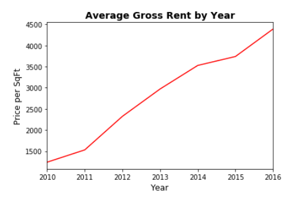
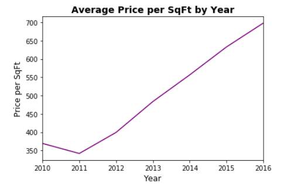
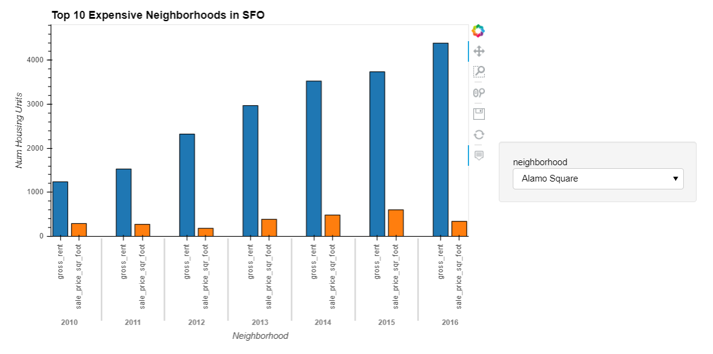
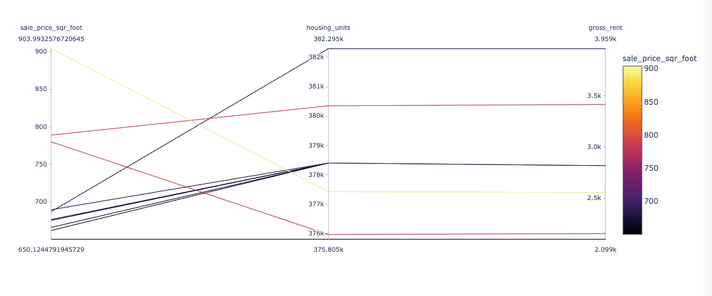

# Pythonic Monopoly

*[San Francisco Park Reading by Juan Salamanca](https://www.pexels.com/photo/park-san-francisco-reading-61109/) | [Free License](https://www.pexels.com/photo-license/)*

## Background

New Real Estate Investment division wants to provide customers with a broader range of portfolio options. Tasked with building a prototype dashboard. The real estate team wants to trial this initial offering with investment opportunities for the San Francisco market. If the new service is popular, then they can start to expand to other markets.

The goal of this dashboard is to provide charts, maps, and interactive visualizations that help customers explore the data and determine if they want to invest in rental properties in San Francisco.

1. [Complete a notebook of rental analysis](#Rental-Analysis).

2. [Create a dashboard of interactive visualizations to explore the market data](#Dashboard).

**Note:** If encounter technical difficulties using PyViz, need to refer to the troubleshooting section of the [PyViz Installation Guide](PyVizInstallationGuide.md).

---

## Instructions

### Rental Analysis

The first step to building the dashboard is to work out all of the calculations and visualizations in an analysis notebook. Once the code is worked out here, it can be copied over to a dashboard code and used with Panel to create the final layout.

#### Housing Units Per Year

Calculating the number of housing units per year and visualizing the results as a bar chart using the Pandas plot function.

Note: By default, the limits auto-scale to the data. However, it is hard to see the difference between the yearly data. The min, max, and standard deviation of the data can be used to manually scale the y limits of the plot.

Default Bar Chart

  

Bar Chart with y-axis limits adjusted

  

#### Average Housing Costs in San Francisco Per Year

Determining the average sales price per year and the average gross rent per year to better understand housing costs over time. For example, a customer will want to know if they should expect an increase or decrease in the property value or rent over time so they can determine how long to hold the rental property. Visualizing the average (mean) gross rent and average price per square foot per year and visualizing it as a bar chart.

1. Calculating the mean `gross_rent` and `sale_price_sqr_foot` for each year.
2. Visualizing the mean `gross_rent` and `sale_price_sqr_foot` for each year as two line charts.

  

  

#### Average Prices By Neighborhood

Using hvplot to create two interactive visulizations of average prices with a dropdown selector for the neighborhood. The first visualization will be a line plot showing the trend of average price per square foot over time for each neighborhood. The second will be a line plot showing the trend of average montly rent over time for each neighborhood. It will be easier to create a new DataFrame from grouping the data and calculating the mean prices for each year and neighborhood.

  
  
  

#### Top 10 Most Expensive Neighborhoods

Figuring out which neighborhoods are the most expensive. Calculating the mean sale price for each neighborhood and then sorting the values to obtain the top 10 most expensive neighborhoods on average. Plotting the results as a bar chart.

  

#### Comparing Cost to Purchase Versus Rental Income

Using `hvplot` to create an interactive visualization with a dropdown selector for the neighborhood. This visualization will feature a side-by-side comparison of average price per square foot versus average monthly rent by year. Using the `hvplot` parameter, `groupby`, to create a dropdown selector for the neighborhood.

#### Neighborhood Map

Reading in neighborhood location data and building an interactive map with the average prices per neighborhood. Using a scatter mapbox object from plotly express to create the visualization. Mapbox API key needed for this.

Creating maps visualizations using Plotly Express, will need to create an account at [mapbox](https://www.mapbox.com/) and [create an access token](https://docs.mapbox.com/help/how-mapbox-works/access-tokens/#creating-and-managing-access-tokens).

  

####  Cost Analysis - Optional Challenge

Using plotly express to create a Parallel Coordinates plot, Parallel Categories plot, and a Sunburst plot so that investors can interactively filter and explore various factors related to the sales price of the neighborhoods.

Using the provided DataFrame to create the following visualizations:

1. Creating a Parallel Coordinates Plot.

  

2. Creating a Parallel Categories Plot.

  

3. Creating a Sunburst plot to show the most expensive neighborhoods in San Francisco per year. More about sunburst charts in Plotly Express in [this link](https://plotly.com/python/sunburst-charts/).

    
 
---

### Dashboard

Working out all of the code and analysis, can use the Panel library to build an interactive dashboard for all of the visualizations.

Dashboard:

  

---
